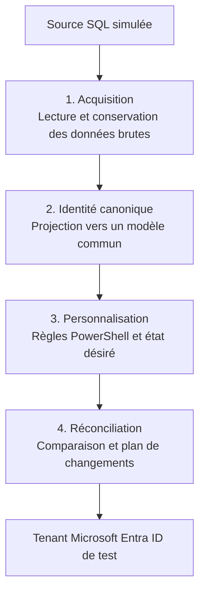
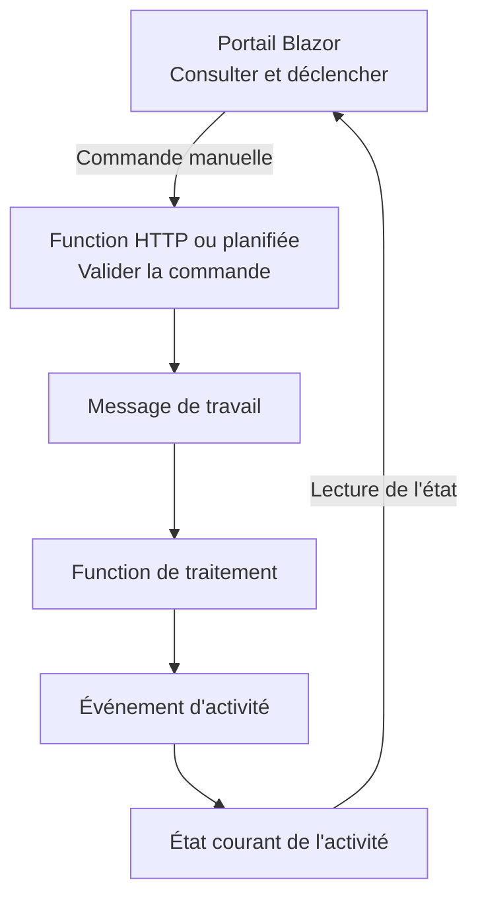
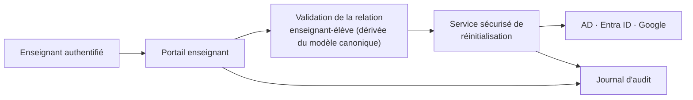

# Architecture — POC de provisionnement d'identités

## Statut du document

Document de travail pour un prototype technique. Il vise à valider l'architecture, à estimer l'effort
de réalisation et à réduire les principales incertitudes. Les sections marquées
**« À approfondir »** identifient des sujets déjà repérés mais non encore détaillés.

## 1. Contexte et positionnement

De nombreuses organisations utilisent **Microsoft Identity Manager (MIM)** pour synchroniser les
identités provenant de systèmes métiers vers leurs répertoires (Active Directory, Microsoft Entra
ID, Google Workspace).

Ce POC vise à explorer un **remplacement autonome** — et non une simple surcouche à MIM — capable
de :

- récupérer les informations des utilisateurs à partir d'une source SQL simulée;
- permettre à des administrateurs de personnaliser leurs règles de transformation;
- provisionner Microsoft Entra ID (cible prioritaire), Active Directory et Google Workspace;
- séparer le noyau technique des configurations propres à chaque organisation.

MIM sert de référence conceptuelle pour comprendre les capacités attendues (voir [§13](#13-comparaison-avec-mim)),
mais ne dicte pas les choix d'architecture.

## 2. Objectifs et principes directeurs

1. **Un noyau commun, des configurations différentes.** Le produit est identique pour toutes les
   organisations; ce qui varie, ce sont les sources, les règles et les destinations configurées.
2. **Séparation entre données et décisions.** Le modèle canonique décrit ce qui provient des sources;
   l'état désiré décrit ce que l'organisation veut obtenir.
3. **PowerShell comme mécanisme de personnalisation.** Les administrateurs personnalisent le
   comportement avec une technologie qu'ils maîtrisent déjà, sans modifier le noyau.
4. **Connecteurs enfichables et pilotés par métadonnées.** Une nouvelle source ou destination
   s'ajoute par configuration, pas par du code propre à un schéma fixe.
5. **Prévisualisation avant application.** Toute synchronisation produit un plan de changements
   consultable avant d'être appliqué aux répertoires.
6. **Traçabilité de bout en bout.** Tout changement dans un répertoire cible doit pouvoir être relié
   à une donnée source, une règle et une exécution précises.
7. **Instance autonome.** Chaque organisation héberge et contrôle sa propre installation,
   ses données, ses secrets et ses règles.
8. **Simplicité d'abord, extensibilité préservée.** Le modèle démarre volontairement simple (une seule
   appartenance active par personne) sans bloquer une évolution future vers des cas plus complexes.

## 3. Modèle de déploiement

- **Auto-hébergé par chaque organisation**, sur site ou dans le nuage de son choix — pas de SaaS
  mutualisé.
- **Application modulaire** composée d'une interface Blazor, de fonctions pour les traitements
  planifiés et d'un noyau partagé.
- **Pile de référence : .NET 10**, **Blazor Web App** pour l'interface et **Azure Functions** pour
  l'acquisition et le provisionnement planifiés, afin de conserver une solution entièrement .NET.
- Le noyau doit rester indépendant de tout fournisseur infonuagique particulier.

## 4. Vue d'ensemble



Composants qui accompagnent ce flux :

- **Blazor Web App** : consultation des états et déclenchement explicite des opérations.
- **Azure Functions** : déclenchement manuel ou planifié des acquisitions et du provisionnement.
- **Noyau partagé** : modèles, projection canonique, règles d'orchestration et réconciliation.
- **Azure Table Storage** : identités, états désirés, activités et résultats opérationnels.
- **Azure Blob Storage** : données brutes, rapports détaillés et autres documents JSON volumineux.
- **Azure Queue Storage** : déclenchement asynchrone des étapes lorsque le découplage est utile.

### 4.1 Couches de données inspirées du modèle médaillon

Le POC reprend la séparation Bronze / Argent / Or populaire en analytique, sans introduire de
plateforme analytique :

| Couche | Nom fonctionnel | Contenu | Stockage |
|---|---|---|---|
| Bronze | Acquisition brute | Données reçues de la source, sans transformation | Blob Storage |
| Argent | Identité canonique | Données normalisées, validées et indépendantes de la source | Table Storage |
| Or | État désiré | Résultat des règles PowerShell prêt à être comparé à une destination | Table Storage |

Les plans de changements, résultats de provisionnement et états observés sont des données
opérationnelles. Ils demeurent séparés des trois couches.

Cette séparation permet :

- de rejouer une acquisition à partir de Bronze;
- de recalculer Argent lorsqu'un mapping change;
- de recalculer Or lorsqu'une règle PowerShell change;
- d'expliquer la provenance d'un changement jusqu'à la donnée brute.

Le code et l'interface utilisent les noms fonctionnels `Acquisitions`, `CanonicalIdentities` et
`DesiredStates`; Bronze, Argent et Or servent seulement à expliquer le modèle architectural.

### 4.2 Activités et événements

L'architecture s'inspire d'une approche événementielle légère. Chaque traitement possède un
`ActivityId` et produit des événements au fur et à mesure de sa progression.



Le portail sépare deux usages :

- **Lecture** : afficher les activités, leur statut, leur chronologie, les identités et les plans de
  changements.
- **Commande** : demander une acquisition, la génération d'un plan ou, lorsqu'elle sera permise,
  l'application d'un plan.

Le portail ne contient pas la logique de traitement et n'appelle jamais directement Microsoft
Graph. Une commande manuelle passe par une fonction HTTP, qui crée l'activité et publie le message
de travail. Les déclenchements planifiés publient le même message et utilisent ensuite exactement
le même parcours.

Une commande exprime une intention, par exemple `StartAcquisition` ou `ApplyChangePlan`. Un événement
décrit un fait déjà survenu, par exemple `AcquisitionCompleted` ou `ProvisioningFailed`.

Deux tables ont des responsabilités distinctes :

| Table | Responsabilité |
|---|---|
| `ActivityEvents` | Journal immuable de tout ce qui s'est produit |
| `Activities` | Projection consolidée du dernier état de chaque activité |

Une table d'événements seule permettrait de reconstruire l'état, mais obligerait le portail à relire
tout l'historique. La table `Activities` fournit directement les activités en cours et leur statut,
tandis que `ActivityEvents` conserve la chronologie complète.

Statuts minimaux :

```text
Pending → Running → Succeeded
                  ↘ Failed
```

Événements initiaux :

- `ActivityRequested`
- `ActivityStarted`
- `AcquisitionCompleted`
- `CanonicalProjectionCompleted`
- `DesiredStateCompleted`
- `ChangePlanCompleted`
- `ProvisioningCompleted`
- `ActivityFailed`

Chaque événement contient au minimum :

- `ActivityId`
- `EventId`
- `EventType`
- `OccurredAt`
- `Status`
- `CorrelationId`
- une référence vers le détail dans Blob Storage lorsque nécessaire.

Pour le POC, les événements servent au suivi et au découplage des traitements. Les tables de données
demeurent les sources de vérité; le système n'implémente pas un *event sourcing* complet.

## 5. Couche 1 — Acquisition et normalisation

### 5.1 Connecteurs pilotés par métadonnées

Principe central : **les connecteurs ne dépendent pas d'un schéma fixe** (base de données ou API).
Le moteur de connecteur (générique, développé une fois) est séparé de la définition de source
(métadonnées, configurée par organisation).

| Concept | Rôle |
|---|---|
| Adaptateur de transport | Sait parler SQL, REST, fichiers (ou autre) |
| Définition de source (métadonnées) | Décrit *quoi* lire : tables/vues/routes, pagination, curseurs, identifiant source, correspondance des propriétés |
| Lecteur générique | Produit des enregistrements sources sans schéma figé |
| Projection canonique | Associe les propriétés découvertes au modèle canonique |

Le connecteur devrait pouvoir **découvrir** les propriétés disponibles d'une source (colonnes/types
d'une table, structure JSON d'une API) pour simplifier la configuration par l'administrateur.

Trois niveaux de réutilisation des métadonnées sont visés :

```text
Noyau commun (moteurs génériques)
    ↓
Profil de source (métadonnées et correspondances)
    ↓
Configuration et surcharges propres à l'organisation
```

### 5.2 Zone d'acquisition (staging)

Les données importées ne sont pas projetées directement dans le modèle canonique. Une zone
intermédiaire conserve les enregistrements sources bruts et leur provenance, ce qui permet de
comparer deux importations, diagnostiquer les erreurs, et rejouer un traitement sans réinterroger
la source.

### 5.3 Chargement itératif et rejeu

Modes de chargement pris en charge :

- **Complet** : relit toute la population d'une source (initialisation, reconstruction, audit).
- **Incrémental** : ne récupère que les changements depuis le dernier point de reprise réussi.
- **Ciblé** : recharge une personne, un établissement, un groupe ou une population précise.
- **Rejeu** : retraite des données déjà acquises (nouveau mapping, nouvelle règle) sans réinterroger
  la source.

Chaque connecteur maintient un **point de reprise** (curseur, date de référence, ou équivalent) qui
n'avance que lorsque le lot est correctement acquis. Les stratégies de détection de changement
(curseur natif, date de modification, identifiant croissant, journal de changements, comparaison
d'empreintes) sont génériques dans le moteur; les métadonnées choisissent laquelle utiliser.

Traitement en **lots identifiables** (créés / modifiés / supprimés / erreurs), pour permettre reprise,
parallélisation et traçabilité. Toute application de lot doit être **idempotente**.

L'absence d'une personne dans un lot incrémental **ne doit jamais**, à elle seule, déclencher une
désactivation — il faut distinguer suppression annoncée, absence partielle, erreur temporaire, et
fin réelle d'inscription/emploi.

## 6. Couche 2 — Modèle canonique

### 6.1 Portée du modèle

Le modèle canonique représente le contexte scolaire complet, pas seulement les attributs nécessaires
aux comptes : personnes, affiliations, établissements, groupes, programmes, relations
responsable-élève.

Trois catégories d'affiliation sont distinguées dès le départ :

- **Élève** : inscription, établissement, programme, niveau, groupes, responsables.
- **Personnel pédagogique** : emploi, établissement(s), fonction(s), matière(s), groupes enseignés.
- **Personnel administratif** : emploi, unité administrative, fonction, établissement(s).

### 6.2 Règle métier initiale : une seule appartenance active

**Décision retenue :** une personne possède exactement une appartenance principale (Élève, Personnel
pédagogique ou Personnel administratif). Le modèle conserve une structure extensible pour permettre
plus tard des affiliations multiples (ex. : enseignant également parent), mais cette capacité est
désactivée par défaut et validée comme telle par le moteur.

### 6.3 Rapprochement / correspondance (« join ») — À approfondir

Lors de l'activation initiale d'un connecteur cible, ou de l'ajout d'un nouveau connecteur, le
système doit retrouver les comptes déjà existants dans Entra/AD/Google plutôt que d'en créer des
doublons (attributs d'ancrage, interface de réconciliation manuelle pour les cas ambigus). Sujet à
détailler avant l'implémentation des connecteurs cibles.

### 6.4 Nom usuel versus nom légal — À approfondir

Une personne peut avoir un nom légal différent de son nom d'usage (situation notamment rencontrée
pour les personnes trans ou non binaires). Le modèle canonique doit porter les deux distinctement;
les règles PowerShell décident consciemment lequel utiliser pour le nom d'affichage, l'UPN ou le
courriel, selon la politique de l'organisation. Le nom légal ne doit pas être exposé
involontairement si une politique de confidentialité s'applique.

## 7. Couche 3 — Personnalisation par script PowerShell

### 7.1 Contrat d'exécution

Les scripts ne manipulent **jamais directement** Entra, AD ou Google. Ils reçoivent des objets
canoniques en entrée et retournent un **état désiré** selon un contrat JSON validé par schéma.

```text
Personne canonique + règles PowerShell locales = état désiré (compte, attributs, appartenances)
```

### 7.2 Sécurité d'exécution

- Exécution dans un **processus worker isolé** (PowerShell 7).
- Aucune transmission directe des secrets aux scripts.
- Modules autorisés par liste blanche; limites de durée et de mémoire.
- Journalisation structurée, sans données sensibles.
- Simulation/prévisualisation obligatoire avant publication d'un changement de règle.

### 7.3 Cycle de vie des scripts

Versionnement, tests avec cas d'exemple, publication, retour arrière. Édition envisagée depuis le
portail avec synchronisation vers un dépôt Git, historique commun entre les deux modes d'édition.

## 8. Couche 4 — Provisionnement

### 8.1 État désiré et réconciliation

Le moteur de provisionnement ne reçoit jamais d'instructions impératives des scripts. Il compare :

```text
État désiré − état réellement observé dans la destination = plan de changements
```

Cette approche rend les traitements prévisibles, testables, reproductibles, auditables, et
indépendants des API particulières de chaque destination.

### 8.2 Connecteurs cibles

Encapsulent les particularités techniques (Microsoft Graph, LDAP, API Google) derrière des
opérations idempotentes. Les scripts PowerShell locaux n'ont pas besoin de connaître ces API.

Ordre de priorité des cibles : **Microsoft Entra ID** en premier; Active Directory et Google
Workspace comme extensions ultérieures du même mécanisme de connecteur.

Pour Microsoft Entra ID, le premier mécanisme évalué est l'approvisionnement entrant piloté par API
avec `/bulkUpload`. Cette API utilise des structures SCIM et délègue au service de provisionnement
Entra le rapprochement, le mapping et l'application des changements. Un jalon technique isolé doit
valider la création, la modification, la désactivation, l'idempotence et la qualité des journaux
avant de retenir cette approche. Microsoft Graph direct demeure l'alternative si cette évaluation
n'est pas concluante.

### 8.3 Synchronisation complète comme filet de sécurité

La portée du chargement (complet / incrémental / ciblé) et le mode d'application (réconciliation
complète / incrémentale) sont deux dimensions indépendantes :

| Chargement | Application | Usage typique |
|---|---|---|
| Incrémental | Incrémentale | Fonctionnement courant, plusieurs fois par jour |
| Complet | Incrémentale | Vérifier qu'aucun changement n'a été manqué |
| Complet | Réconciliation complète | Récupération après incident, remise en confiance |
| Ciblé | Réconciliation complète | Corriger une personne, un groupe, un établissement |

La synchronisation complète compare l'état désiré recalculé pour toute la population à l'**état
réellement observé** dans les répertoires (et non à l'historique des exécutions passées), ce qui
permet de détecter et corriger les dérives causées par des modifications faites hors du toolkit.

Protections obligatoires : prévisualisation systématique, **seuils de sécurité renforcés** (ex. :
arrêt automatique et approbation requise si un pourcentage anormal de désactivations/suppressions est
détecté — équivalent du seuil de suppression à l'export de MIM), portée réductible (un établissement
ou une population plutôt que toute l'organisation), mode simulation pur.

Le mode incrémental est traité comme une **optimisation de performance** du même moteur de
réconciliation, et non comme un chemin de code distinct, afin d'éviter toute divergence de
comportement entre les deux modes.

## 9. Gouvernance des propriétés (autorité et *writeback*)

### 9.1 Principe

Chaque propriété canonique a une **autorité** déclarée : le système qui a le droit de décider de sa
valeur.

| Type d'autorité | Exemple |
|---|---|
| Source SQL | Prénom, nom, identifiant externe, établissement, groupe |
| Calculée (toolkit) | UPN, adresse courriel, nom d'utilisateur, unité organisationnelle |
| Destination | Identifiant d'objet Entra, SID AD, identifiant Google |
| Locale | État technique d'un connecteur, propriétés internes à une destination |

### 9.2 *Writeback*

Une propriété calculée par le toolkit (ex. : UPN) peut être retournée vers la source SQL après confirmation
par la destination — c'est la **valeur confirmée**, pas seulement la valeur initialement calculée,
qui est écrite en retour, afin d'éviter de propager une valeur qui aurait été refusée.

```text
Source SQL → canonique → règles PowerShell → état désiré → répertoire cible
                                                              ↓
                                                     valeur confirmée
                                                              ↓
                                                 writeback vers la source SQL
```

Le moteur doit reconnaître qu'une propriété réimportée peut être soit une valeur de référence, soit
une valeur précédemment écrite par le toolkit, afin d'éviter les boucles de réécriture.

### 9.3 Autorité effective par personne (exceptions manuelles)

Un administrateur peut remplacer l'autorité par défaut d'une propriété **pour une personne
spécifique** (ex. : adresse courriel modifiée manuellement en cas d'homonymie). Cette exception :

- prévaut sur la valeur calculée ou importée tant qu'elle est active;
- peut avoir une date d'expiration (retour automatique à la politique par défaut);
- exige une justification et conserve un historique complet (auteur, ancienne/nouvelle valeur,
  ancienne/nouvelle autorité, motif, date, résultat du provisionnement);
- reste distincte d'un changement de politique globale (qui modifie l'autorité par défaut pour toute
  une population, avec sa propre prévisualisation d'impact).

```text
Valeur effective =
    exception manuelle active
    sinon valeur de l'autorité configurée
    sinon absence ou conflit explicite
```

### 9.4 Interface de gouvernance

Le portail d'administration doit exposer, pour chaque personne, un tableau par propriété montrant :
valeur effective, autorité par défaut, autorité effective, valeurs observées dans chaque système,
règle ayant produit la valeur, destinations concernées, état (synchronisée / modification planifiée
/ exception manuelle / conflit / erreur / en attente de writeback / non applicable), et historique.

## 10. Plan de contrôle transversal

Composants qui supervisent les quatre couches sans constituer une étape de traitement :

- Portail d'administration (Blazor Web App).
- Azure Functions pour les déclenchements manuels et planifiés.
- Logique d'orchestration partagée entre les différents déclencheurs.
- API de gestion minimale seulement si les besoins du POC l'exigent.
- Catalogue de connecteurs (sources et cibles disponibles).
- Gestion des scripts PowerShell (édition, versions, tests, publication).
- Prévisualisation et approbation des changements.
- Audit (journal complet, y compris accès aux renseignements personnels).
- Observabilité (métriques, alertes, diagnostic de bout en bout d'une identité).
- Gestion des secrets et des accès (RBAC interne au produit).

## 11. Services d'identité en libre-service

En complément de la synchronisation en arrière-plan, le produit expose des **opérations
ponctuelles**, dont la première capacité ciblée est la réinitialisation de mot de passe déléguée aux
enseignants (besoin propre au milieu scolaire : les jeunes élèves oublient fréquemment leur mot de
passe).



Principes :

- L'autorisation est **dérivée des relations scolaires actuelles** (groupes enseignés), pas d'une
  liste d'autorisations gérée manuellement.
- Le portail ne parle jamais directement à Entra/AD/Google : il passe par un **service d'opérations
  d'identité** commun, qui applique les mêmes règles de sécurité et réutilise les connecteurs.
- Politiques configurables par organisation : qui peut agir, pour quels élèves, génération vs choix du mot de
  passe, complexité, changement obligatoire à la prochaine connexion, limites de fréquence.
- Le mot de passe en clair n'est jamais journalisé; protection contre les réinitialisations massives.

Cette capacité positionne le produit au-delà d'un simple moteur de synchronisation : il répond aussi
aux besoins opérationnels quotidiens des écoles, ce que MIM ne couvre pas nativement.

## 12. Modèle de réutilisation envisagé

```text
Niveau 1 — Noyau
    Pipeline (4 couches), orchestration, sécurité, audit, portail, moteurs de connecteurs génériques.

Niveau 2 — Connecteurs techniques communs
    SQL, REST, fichiers ; Entra ID, Active Directory, Google Workspace.

Niveau 3 — Profils communautaires
    Métadonnées et correspondances proposées pour des schémas de sources courants.

Niveau 4 — Personnalisation locale
    Configuration, métadonnées surchargées, scripts PowerShell propres à l'organisation.
```

Le POC doit valider que ces niveaux peuvent évoluer indépendamment. Le modèle de gouvernance et de
contribution sera déterminé ultérieurement.

## 13. Comparaison avec MIM

| Concept MIM | Concept du toolkit |
|---|---|
| Management Agent | Connecteur générique piloté par métadonnées |
| Connector Space | Zone d'acquisition (staging) |
| Metaverse | Modèle canonique |
| Join / Projection | Rapprochement avec une identité canonique |
| Synchronization Rules | Scripts PowerShell de personnalisation |
| Export Flow | Projection vers l'état désiré |
| Export | Connecteur de provisionnement |
| Run Profiles | Travaux orchestrés et planifiés |
| Preview | Plan de changements avant application |
| Export deletion threshold | Seuils de sécurité de la synchronisation complète |
| Synchronization History | Historique d'exécution et journal d'audit |

Aspects de MIM à ne pas reproduire : configuration éclatée entre plusieurs interfaces, règles
difficiles à versionner, dépendance forte à une infrastructure Windows particulière, logique cachée
dans des extensions compilées, diagnostic exigeant une expertise très spécialisée.

## 14. Pile technologique de référence

| Élément | Choix |
|---|---|
| Noyau partagé | .NET 10 |
| Interface | Blazor Web App |
| Acquisition et provisionnement planifiés | Azure Functions |
| API | Minimale, ajoutée seulement si requise par le POC |
| Données structurées et suivi des activités | Azure Table Storage |
| Données brutes et rapports détaillés | Azure Blob Storage |
| Déclenchements asynchrones | Azure Queue Storage |
| Personnalisation | PowerShell 7 (processus isolé) |
| Hébergement | Auto-hébergé par chaque organisation, sur site ou dans le nuage de son choix |
| Base de données | À déterminer (relationnelle, interchangeable) |

## 15. Exigences non fonctionnelles

- **Sécurité** : moindre privilège pour chaque connecteur, secrets gérés par le noyau, jamais par les
  scripts; environnements dev/test/prod distincts (voir §16).
- **Auditabilité** : toute valeur doit pouvoir être expliquée (source, règle, version de script,
  confirmation de destination, date, exécution).
- **Idempotence** : rejouer un lot ou une synchronisation complète ne doit produire aucun effet
  supplémentaire.
- **Performance/volumétrie** : capacité de traitement par lots à grande échelle pour la période de
  rentrée scolaire (dizaines de milliers de comptes en quelques jours), avec gestion des limites de
  débit des API cibles.
- **Portabilité** : indépendance vis-à-vis d'un fournisseur infonuagique particulier.
- **Conformité** : Loi 25 (classification des données sensibles, journal des accès aux
  renseignements personnels, conservation/suppression réelle) — voir §16.

## 16. Sujets identifiés à approfondir

Ces sujets ont été repérés durant les échanges mais ne sont pas encore détaillés au niveau
architectural :

1. Cycle de vie complet (statuts intermédiaires : congé, suspension, suppléance; périodes de grâce
   avant suppression; transferts entre établissements ou entre organisations).
2. Rapprochement initial des comptes existants (« join ») lors de l'activation d'un connecteur cible.
3. Nom usuel versus nom légal (voir §6.4).
4. Populations particulières hors du modèle simple (stagiaires, suppléants, bénévoles, comptes de
   service).
5. Gestion des groupes, licences et accès applicatifs au-delà des comptes (groupes de sécurité,
   licences Microsoft 365, boîtes aux lettres).
6. Génération et distribution des identifiants (lettres/cartes d'identité imprimables pour jeunes
   élèves), en lien avec le portail de réinitialisation.
7. Conformité et résidence des données selon le choix d'hébergement de chaque organisation.
8. Rôles administratifs internes au produit et séparation dev/test/prod.
9. API en lecture et événements pour intégration avec d'autres systèmes (aide, LMS, portail parent).
10. Modèle éventuel de gouvernance et de contribution (licence, versions, mises à jour du noyau sans
    casser les personnalisations locales).
11. Continuité de service du toolkit lui-même (sauvegardes de configuration et de secrets, reprise).

## 17. Portée et décisions du POC

- La première source est une base SQL simulée avec un schéma et des données représentatifs, sans
  dépendance à un produit ou à une organisation réelle.
- Modèle exact du contrat canonique v1 (liste précise des entités et propriétés).
- Format exact des métadonnées de connecteur et du contrat d'entrée/sortie des scripts PowerShell.
