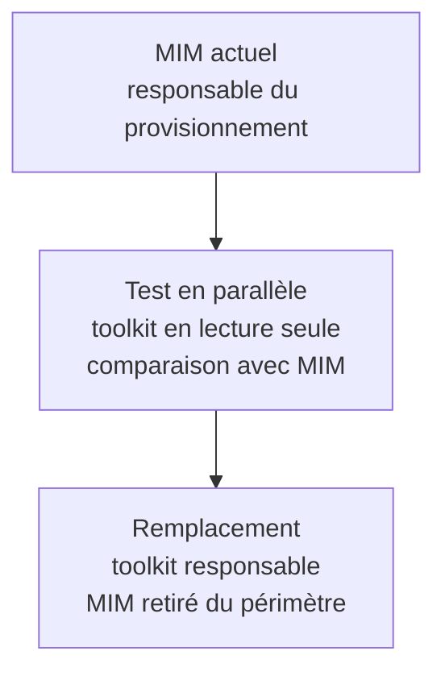

# Plan de travail — POC de provisionnement d'identités

Remplacement de MIM. Complémentaire à [architecture.md](./architecture.md).

La réalisation du prototype est découpée en petits jalons testables dans le
[plan de développement du POC](./plan-developpement-poc.md).

Le [registre des écarts de cybersécurité](./registre-ecarts-cybersecurite.md) est révisé au fil des
jalons et fait partie des critères de passage vers le pilote et la production.

Règle simple : MIM reste responsable pendant que le toolkit est testé en parallèle. Une fois les
résultats validés, le toolkit remplace MIM.

## 1. Stratégie de transition depuis MIM

Pendant le test en parallèle, le toolkit lit les mêmes données et produit les changements qu'il
aurait appliqués, sans écrire dans les répertoires. 

## 2. Étapes concrètes

### Étape 0 — Objectifs du POC

- Réaliser un prototype technique afin de préciser l'architecture, d'évaluer l'effort requis et de
  réduire les principales incertitudes. Les résultats permettront ensuite de statuer sur le
  positionnement du projet, sa portée et les suites à lui donner.
- Définir une source SQL simulée et un jeu de données représentatif.
- Définir les scénarios techniques qui serviront à valider le POC.
- Définir les rôles nécessaires (voir §4).

### Étape 1 — Fondations du noyau

- Mettre en place la structure du projet (.NET 10, API, portail Blazor, workers).
- Définir la version 1 du contrat canonique (entités, propriétés, appartenances Élève / Personnel
  pédagogique / Personnel administratif).
- Construire le moteur de connecteur générique piloté par métadonnées pour au moins une technologie
  de transport, en commençant par la source SQL simulée.
- Mettre en place la zone d'acquisition (staging) et le mécanisme de points de reprise pour le
  chargement itératif.

### Étape 2 — Personnalisation PowerShell (mode observation)

- Définir le contrat d'entrée/sortie des scripts PowerShell (objets canoniques en entrée, état
  désiré en sortie).
- Construire l'hôte d'exécution isolé (limites de durée/mémoire, liste blanche de modules, aucune
  transmission de secrets).
- Permettre l'édition et le versionnement des scripts (portail + dépôt Git).
- Exécuter en mode observation seulement : produire l'état désiré sans le comparer encore à un
  répertoire réel.

### Étape 3 — Provisionnement Entra ID (test en parallèle)

- Construire le connecteur Entra ID (lecture de l'état observé, écriture idempotente).
- Construire le moteur de réconciliation (état désiré − état observé = plan de changements).
- Exécuter le toolkit en lecture seule et produire les plans de changements qu'il aurait appliqués.
- Implémenter les seuils de sécurité (arrêt automatique en cas de
  volume anormal de désactivations/suppressions).
- Comparer systématiquement les plans de changements du toolkit aux actions réellement posées par
  MIM sur la même population.

### Étape 4 — Remplacement de MIM

- Choisir le périmètre initial du remplacement (population, établissement ou organisation).
- Retirer la responsabilité de MIM sur ce périmètre avant d'activer les écritures du toolkit, afin
  qu'un seul système soit responsable du provisionnement.
- Mettre en place la synchronisation complète comme filet de sécurité (réconciliation, seuils,
  portée réductible).
- Surveiller le remplacement et élargir la portée lorsque le périmètre initial est stable.

### Étape 5 — Gouvernance des propriétés

- Implémenter le modèle d'autorité par propriété (source / calculée / destination / locale).
- Implémenter le *writeback* vers la source SQL pour les propriétés calculées confirmées par la
  destination.
- Construire l'interface d'exceptions manuelles par personne (autorité effective, justification,
  expiration, historique).

### Étape 6 — Services d'identité en libre-service

- Construire le portail enseignant de réinitialisation de mot de passe déléguée.
- Dériver l'autorisation des relations scolaires du modèle canonique (groupes enseignés).
- Faire passer les opérations par le service d'opérations d'identité commun (pas d'accès direct aux
  répertoires depuis le portail enseignant).

### Étape 7 — Extension des connecteurs cibles

- Ajouter Active Directory.
- Ajouter Google Workspace.
- Réutiliser le même moteur de réconciliation et les mêmes mécanismes de sécurité déjà validés pour
  Entra ID.

### Étape 8 — Retrait de MIM

- Étendre l'activation réelle à l'ensemble du périmètre prévu.
- Décommissionner MIM sur ce périmètre une fois les critères de succès pleinement satisfaits.

### Étape 9 — Préparation à l'industrialisation

- Documenter le processus de déploiement et de configuration pour une nouvelle organisation.
- Extraire des profils de connecteurs réutilisables pour différents schémas de sources.
- Valider que le toolkit peut être configuré pour un second contexte sans modifier son noyau.

## 3. Sujets à trancher avant ou pendant certaines étapes

| Sujet | Lié à l'étape | Référence |
|---|---|---|
| Contenu du schéma et du jeu de données SQL simulé | Étape 0 / 1 | Architecture §17 |
| Modèle exact du contrat canonique v1 | Étape 1 | Architecture §17 |
| Format des métadonnées de connecteur | Étape 1 | Architecture §5.1, §17 |
| Rapprochement initial des comptes existants (« join ») | Étape 3 | Architecture §6.3 |
| Nom usuel versus nom légal | Étape 1 ou 5 | Architecture §6.4 |
| Populations particulières (stagiaires, suppléants, bénévoles) | Étape 1 ou 7 | Architecture §16.4 |
| Cycle de vie complet (congés, suspensions, transferts) | Étape 4 ou 5 | Architecture §16.1 |
| Génération et distribution des identifiants imprimables | Étape 6 | Architecture §16.6 |
| Conformité Loi 25 et résidence des données | Étape 0 et en continu | Architecture §16.7 |
| Rôles administratifs internes et environnements dev/test/prod | Étape 0 / 1 | Architecture §16.8 |
| API/événements pour systèmes externes | Étape 7 ou 9 | Architecture §16.9 |
| Modèle éventuel de gouvernance et de contribution | Étape 9 | Architecture §16.10 |

## 4. Rôles nécessaires

- **Responsable du produit / architecture** : arbitrage des décisions structurantes, cohérence entre
  les scénarios du POC.
- **Équipe de développement** : noyau, connecteurs, portail.
- **Expert(s) métier** : rédaction des règles PowerShell, validation des résultats et connaissance
  des données simulées.
- **Responsable de la sécurité et de la conformité** : validation des seuils de sécurité, de la
  gestion des secrets, et des exigences Loi 25.
- **Responsable des données** : définition du schéma SQL simulé et des cas de test.

## 5. Critères de sortie par étape

- **Test en parallèle → remplacement** : les identités canoniques et les plans de changements du
  toolkit concordent avec les actions réellement posées par MIM sur une population représentative
  et pendant une période soutenue; les écarts sont expliqués et les seuils de sécurité validés.
- **Remplacement → élargissement** : zéro incident causé par le toolkit sur le périmètre initial;
  les seuils de sécurité ont été déclenchés au moins une fois sans faux positif bloquant.
- **Retrait de MIM** : toutes les populations et cibles nécessaires sont couvertes; le writeback
  fonctionne de façon fiable; l'organisation gère ses règles PowerShell sans dépendre de l'équipe
  noyau.
- **Industrialisation** : un second contexte est déployé et configuré avec la seule documentation,
  sans modification du noyau.

## 6. Risques et pistes de mitigation

| Risque | Mitigation |
|---|---|
| Dérive entre l'état désiré et l'état réel des répertoires | Synchronisation complète planifiée en filet de sécurité; seuils de sécurité à l'export |
| Boucle de réécriture entre le toolkit et la source SQL (writeback) | Modèle d'autorité par propriété; écriture uniquement de la valeur confirmée par la destination |
| Pointe de volumétrie sur une courte période | Traitement par lots, gestion des limites de débit des API et tests de charge |
| Scripts PowerShell mal isolés ou peu sécurisés | Hôte d'exécution isolé, liste blanche de modules, aucun secret transmis aux scripts |
| Résistance au changement / perte de confiance envers un nouvel outil | Comparaison prolongée en mode observation et prévisualisation avant toute bascule réelle |
| Divergence entre les contextes rendant la réutilisation difficile | Séparation stricte entre le noyau, les profils de source et la personnalisation locale, dès l'étape 1 |
